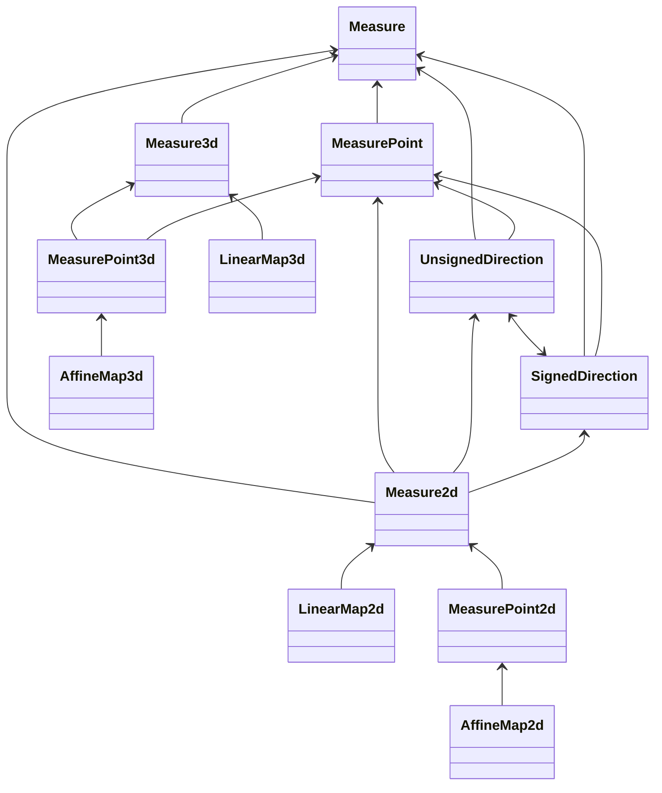
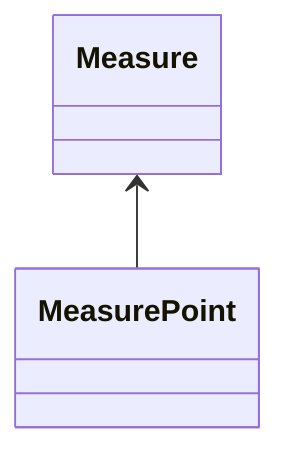
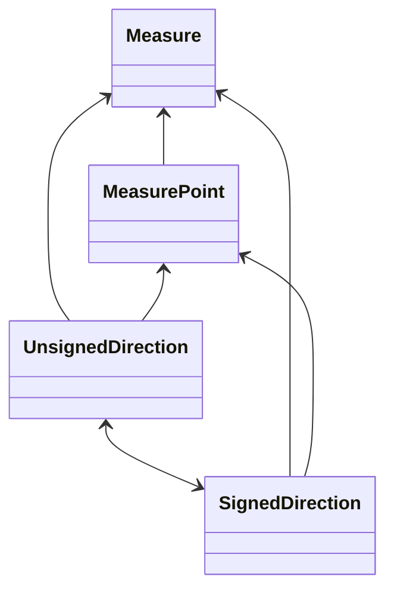
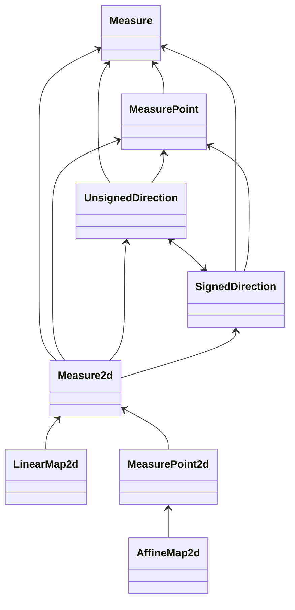
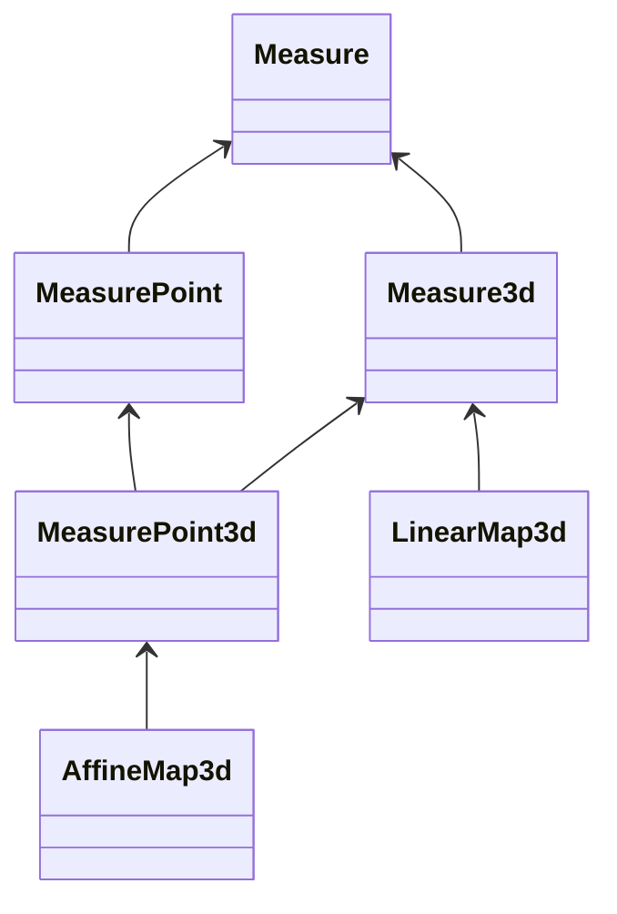

# Architecture

## Types

Here are the types that can be defined by this library:
* `Measure<Unit, Number>`: It defines generic 1-dimensional relative measures (or variations), as vectors in a 1-dimensional vector space. It has no dependencies.
* `MeasurePoint<Unit, Number>`: It defines generic 1-dimensional absolute measures (or positions), as points in a 1-dimensional affine space. It directly depends on type `Measure`.
* `UnsignedDirection<Unit, Number>`: It defines directions in a plane, as angles with a value constrained to be between 0 included and 1 cycle excluded (360°). It directly depends on types `MeasurePoint`, `SignedDirection`.
* `SignedDirection<Unit, Number>`: It defines directions in a plane, as angles with a value constrained to be between minus half cycle included (-180°) and plus half cycle excluded (+180°). It directly depends on types `MeasurePoint`, `UnsignedDirection`.
* `Measure2d<Unit, Number>`: It defines generic 2-dimensional relative measures (or variations), as vectors in a 2-dimensional vector space, having components X and Y. It directly depends on type `MeasurePoint`, `UnsignedDirection`, `SignedDirection`.
* `MeasurePoint2d<Unit, Number>`: It defines generic 2-dimensional absolute measures (or positions), as points in a 2-dimensional affine space, having components X and Y. It directly depends on type `Measure2d`.
* `Measure3d<Unit, Number>`: It defines generic 3-dimensional relative measures (or variations), as vectors in a 3-dimensional vector space, having components X, Y and Z. It directly depends on type `Measure`.
* `MeasurePoint3d<Unit, Number>`: It defines generic 3-dimensional absolute measures (or positions), as points in a 3-dimensional affine space, having components X, Y and Z. It directly depends on type `MeasurePoint`, `Measure3d`.
* `LinearMap2d<Number>`: It defines linear transformations in a plane of objects of type `Measure2d`. It directly depends on type `Measure2d`.
* `AffineMap2d<Unit, Number>`: It defines affine transformations in a plane of objects of type `MeasurePoint2d`. It directly depends on type `MeasurePoint2d`.
* `LinearMap3d<Number>`: It defines linear transformations in 3d-space of objects of type `Measure3d`. It directly depends on type `Measure3d`.
* `AffineMap3d<Unit, Number>`: It defines affine transformations in 3d-space of objects of type `MeasurePoint3d`. It directly depends on type `MeasurePoint3d`.
* `Angle`: It is the only predefined measurement property. It has no dependencies.
* `Radian`: It is the only predefined unit of measurement of property `Angle`. It depends on type `Angle`.

Such types and their dependencies are shown in this class diagram:

### All types (`define_1d_2d_3d`)


To use them, they must be defined *inside* application code, by invoking a macro.
Any application does not necessarily needs all those types.
Therefore, the library provides several macros, to define just some of the above types.

Here are the available macros:
* `define_1d`: It defines the 1-dimensional types `Measure` and `MeasurePoint`.
* `define_1d_and_directions`: In addition to what defined by `define_1d`, it defines the direction types `UnsignedDirection` and `SignedDirection`.
* `define_1d_2d`: In addition to what defined by `define_1d_and_directions`, it defines the 2-dimensional types `Measure2d` and `MeasurePoint2d`, and the 2-dimensional transformation types `LinearMap2d` and `AffineMap2d`.
* `define_1d_3d`: In addition to what defined by `define_1d`, it defines the 3-dimensional types `Measure3d` and `MeasurePoint3d`, and the 3-dimensional transformation types `LinearMap3d` and `AffineMap3d`.
* `define_1d_2d_3d`: In addition to what defined by `define_2d`, it defines the 3-dimensional types `Measure3d` and `MeasurePoint3d`, and the 3-dimensional transformation types `LinearMap3d` and `AffineMap3d`.

A diagram for the macro `define_1d_2d_3d` has already been shown before.
Here are the diagrams showing the schema defined by the other macros.

### 1D measures (`define_1d`)


### 1D measures and directions (`define_1d_and_directions`)


### 1D measures, 2D measures, 2D transformations, and directions (`define_1d_2d`)


### 1D measures, 3D measures, 3D transformations (`define_1d_3d`)


## Limitations

This library is not meant to support:
* An exploratory style of development. The Rust language itself was not designed for that. Those who need a more interactive environment should use an interpreted language, like Scratch, Python or Wolfram.
* Advanced theoretical physics. Modern theoretical physics uses concepts like a space with more than 3 dimensions, or with a non-Euclidean geometry.
* Quantities whose units may have a varying value, like currencies.
* Integer or fixed-point numbers.
* Arbitrary-precision numbers. Currently, the value type can be only `f32` and `f64`. Maybe that in the future a higher-precision value type will be supported, possibly having 80 or 128 bits.
* Powerful linear algebra algorithms. Currently some linear and affine transformations are supported. Maybe some others will be added, if they are simple enough.

## Why only three dimensions

This library is meant to support computations commonly performed in software used for engineering. Such systems use typically only 1, 2, or 3 dimensions to represent quantities.

## Why macros are used

Most crates define types and allow application code to use such types by instantiating them.
Instead, the crate `rs_measures` is essentially a set of the five macros: `define_1d`, `define_1d_and_directions`, `define_1d_2d`, `define_1d_3d`, and `define_1d_2d_3d`.

Let's see why this solution has been chosen.

This library has the purpose of allowing the user to write code like the following one. First, we define some properties to measure, like `ElectricCurrent`, `ElectricCharge`, and `Time`, using these statements:
```rust
pub struct ElectricCurrent;
pub struct ElectricCharge;
pub struct Time;
```

Then, we define some units of measurement for the defined properties, like `Ampere` for `ElectricCurrent`, `Coulomb` for `ElectricCharge`, and `Second` for `Time`, using these statements:
```rust
use rs_measures::traits::MeasurementUnit;

pub struct Ampere;
impl MeasurementUnit for Ampere {
    type Property = ElectricCurrent;
    const RATIO: f64 = 1.;
    const OFFSET: f64 = 0.;
    const SUFFIX: &'static str = " A";
}

pub struct Coulomb;
impl MeasurementUnit for Coulomb {
    type Property = ElectricCharge;
    const RATIO: f64 = 1.;
    const OFFSET: f64 = 0.;
    const SUFFIX: &'static str = " C";
}

pub struct Second;
impl MeasurementUnit for Second {
    type Property = Time;
    const RATIO: f64 = 1.;
    const OFFSET: f64 = 0.;
    const SUFFIX: &'static str = " s";
}
```

With the above definitions, we can define measures having the defined units, with these statements:
```rust
    use rs_measures::measure1d::Measure;
    let charge = Measure::<Coulomb>::new(6.);
    let time = Measure::<Second>::new(2.);
    let mut current: Measure<Ampere>;
```

Though, the operations involving values of more that one property are not allowed yet. For example, the following statement, albeit reasonable, would generate a syntax error:
```rust
    current = charge / time;
```

The main error message is: ``cannot divide `Measure<Coulomb>` by `Measure<Second>` ``. A help message is: ``the trait `Div<Measure<Second>>` is not implemented for `Measure<Coulomb>` ``.

So, there is the need to implement the trait `Div<Measure<Second>>` for the type `Measure<Coulomb>`.

The Rust language specifies that *only traits defined in the current crate can be implemented for types defined outside of the crate*. So, either the trait or the type for which it is implemented must be defined in the same crate in which there is the implementation.

Let's consider these alternatives:
1. Either the trait or the type are defined in our library. In such a case, we can implement that trait inside our library.
2. Either the trait or the type are defined in our application. In such a case, we can implement that trait inside our application.

The trait is `core::ops::Div`, and so it is defined neither in our library nor in our application.

The type for which it is implemented is `Measure<Coulomb>`. We need it to be defined in the library or in the application. By design, we want to keep `Coulomb` in the application. So, `Measure<Coulomb>` cannot be in the library.
But if in the library there is this definition:
```rust
pub struct Measure<Unit> {
    pub value: f64,
    phantom: core::marker::PhantomData<Unit>,
}
```

and in the application there is this definition:
```rust
impl core::ops::Div<Measure<Second>> for Measure<Coulomb> {
    type Output = Measure<Ampere>;
    fn div(self, other: Measure<Second>) -> Self::Output {
        Self::Output::new(self.value / other.value)
    }
}
```

When compiling this application code, this error is obtained:
```text
only traits defined in the current crate can be implemented for types defined outside of the crate
```

and the further explanation:
```text
impl doesn't use only types from inside the current crate
```

Therefore, the type `Measure<Coulomb>` must be wholly kept in the application, i.e. we must define also `Measure` in the application.
In such a way, that trait implementation can be defined inside the application.

To define both the type `Measure` and the implementation of `Div` in the application, without writing all the code there, the solution is to define macros. Such macros are defined in libraries, but they are expanded in the application, and so both the type `Measure` and the implementation of `Div` appear to the compiler as they were defined in the application.

So, the crate `rs_measure` does not define directly the type `Measure` and other types. Instead it exposes, in addition to some auxiliary traits, functions, and macros, only five macros. When such macros are called, the features of the crate are expanded inside the caller code.

In particular, one of such feature is the generic type `Measure`, that so becomes a user-defined type. Being `Measure` a user-defined type, a standard-library trait can be implemented for it.

The crate `rs_measure` is designed to be used by applications needing only 1-dimensional measure, or by applications needing only 1-dimensional and 1-dimensional measures, or by applications needing also 3-dimensional measures. It would be a useless overhead to provide more dimensions than what is required.

Therefore, the crate `rs_measure` provides essentially the five declarative macros described in the section `Types`.
Actually, to implement them some other macros have been defined.
Such macros must be called by the five macros, that are expanded in application code, and so they must be exported by the crate.
Though, they shouldn't be used from code written by application programmers.
To make this clear, they are defined in source files put in the folder `inner`, and their name make somewhat clear their private use.
They are:
* `inner_define_measure`. It defines the generic type `Measure<Unit, Number>`.
* `inner_define_measure_2d`. It defines the generic type `Measure2d<Unit, Number>`.
* `inner_define_measure_3d`. It defines the generic type `Measure3d<Unit, Number>`.
* `inner_define_measure_point`. It defines the generic type `MeasurePoint<Unit, Number>`.
* `inner_define_measure_point_2d`. It defines the generic type `MeasurePoint2d<Unit, Number>`.
* `inner_define_measure_point_3d`. It defines the generic type `MeasurePoint3d<Unit, Number>`.
* `inner_define_linear_map_2d`. It defines the generic type `LinearMap2d<Number>`.
* `inner_define_linear_map_3d`. It defines the generic type `LinearMap3d<Number>`.
* `inner_define_affine_map_2d`. It defines the generic type `AffineMap2d<Unit, Number>`.
* `inner_define_affine_map_3d`. It defines the generic type `AffineMap3d<Unit, Number>`.
* `inner_define_unsigned_direction`. It defines the generic type `UnsignedDirection<AngleUnit, Number>`.
* `inner_define_signed_direction`. It defines the generic type `SignedDirection<AngleUnit, Number>`.

To implement the mixed-unit operations, like the division of a measure in coulomb by a measure in seconds, a procedural macro has been designed, named `define_units_relation`. Procedural macros must be defined in a distinct crate, and so the crate `units-relation` has been created just to define this procedural macro.
